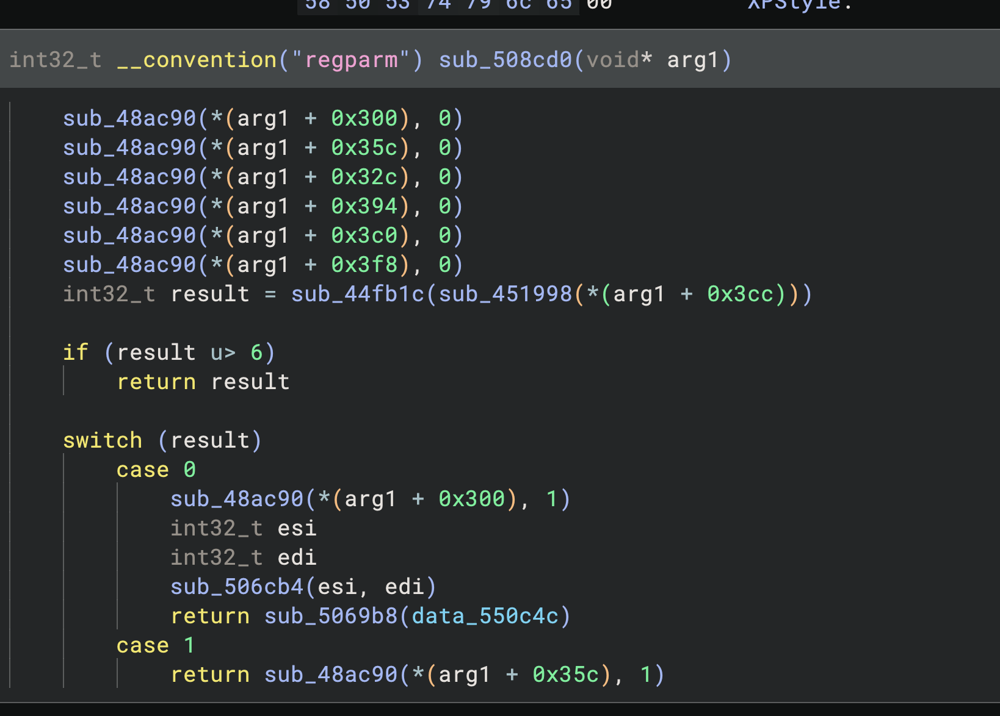
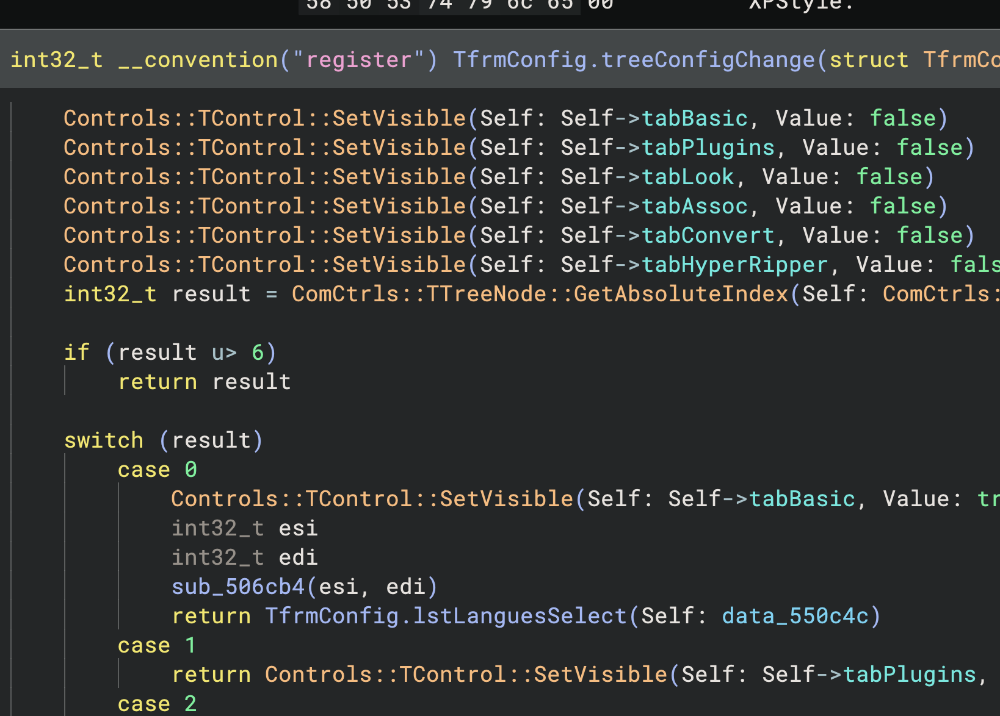

# Delphinja

Binary Ninja workflow for Delphi and the Visual Component Library (VCL). Includes:

- **Metadata recovery** parses binary metadata: virtual method tables (VMTs),
  published method/field/dynamic-method tables, interface tables and the full
  `TTypeInfo`/`TTypeData` runtime type information (RTTI) graph. Turns them into types, names and
  class layouts.
- **Borland demangler** a custom Borland symbols demangler.
- **Signature libraries** ([WARP](https://dev-docs.binary.ninja/guide/warp.html),
  Binary Ninja's signature format) cover what no binary carries: the ordinary virtual
  methods and unit-level runtime library (RTL) procedures that Delphi statically links and
  strips the symbols from. These ship with the plugin and are loaded when a
  Delphi binary is recognised, so nothing has to be copied into a signature
  directory.
- **Detailed MAP files** contribute value-sorted public symbols through Binary
  Ninja's external debug-info path, with rebasing-safe section mapping and
  bounded parsing.
Delphi 2 through 13 are supported, and Free Pascal 2.6 through 3.2. Delphi
metadata recovery currently targets Win32; Free Pascal runtime signatures
cover both Win32 and Win64 when an FPC version marker is present. The VMT
layout is detected per binary, and every offset is derived from it rather than
written down, which is what lets one build read every version. Delphi 2 is the
one era whose VMT keeps no self-pointer to be found by, so its classes are
recognised by the shape of the header instead; every version after it
announces itself.

## What it looks like

One event handler in [Dragon UnPACKer 5](https://github.com/elbereth/DragonUnPACKer),
a GPL archive tool built with Delphi 7, at `0x508cd0`.

Stock Binary Ninja:

With the plugin:

Three things changed. The function name and the `TfrmConfig` struct with its
field names come from the binary's own published method and field tables.
`Controls::TControl::SetVisible`, `ComCtrls::TCustomTreeView::GetSelected` and
`ComCtrls::TTreeNode::GetAbsoluteIndex` come from the signature libraries;
`::` marks a signature match, `.` a name the binary carried. Six identical
`sub_48ac90` calls and six raw offsets become the tab names the code is
actually toggling.

## Layout

    rtti/          the decoder and everything that applies what it finds
    integration/   how that reaches Binary Ninja: workflow, debug info, WARP
    signatures/    the .warp libraries, loaded when a binary needs them
    tools/         standalone signature generation tools

Further reading:

- [tools/README.md](tools/README.md) -- how the shipped signature libraries are built.
- [docs/DFM.md](docs/DFM.md) -- the compiled form stream format, and how event
  handlers are bound to the controls that raise them.
- [docs/MAP.md](docs/MAP.md) -- supported MAP records, address mapping, safety
  policy, and fixture provenance.
- [docs/DATA_SOURCES.md](docs/DATA_SOURCES.md) -- roadmap for JDBG, TDS, BPL,
  DCU/DCP, and Win64 RSM research.

## Tests

Run the unit and headless integration tests with:

    python3 tests/run.py

The runner creates a new private `BN_USER_DIRECTORY`, copies only
`license.dat` and the enterprise server URL from the real Binary Ninja
profile, and symlinks this checkout into its otherwise empty `plugins`
directory. Tests run in a child process using Binary Ninja's bundled Python;
the entire profile is removed after that process exits. Settings changed by a
test therefore cannot affect the interactive profile.

Use `--pattern 'test_parser.py'` to run one test module, or repeat
`--setting KEY=JSON` to change settings in the disposable profile for a test
run.

Pass `--corpus-smoke path/to/sample.exe` to opt in to a real-PE integration
check that scans and applies metadata in memory. `--corpus-smoke` without a
path uses a known local corpus sample when one exists. This slower check is
never part of the default suite or CI.

GitHub CI runs `python3 tests/run_pure.py`, syntax checks, manifest validation,
and evaluator CLI checks without a Binary Ninja license. The isolated
`python3 tests/run.py` suite remains the authoritative check because it loads
the plugin and exercises the Binary Ninja API.

On macOS the runner prefers the development application. Set `BN_TEST_APP`
to test another application bundle. On any platform, `BN_TEST_PYTHON` selects
an interpreter explicitly; `BN_TEST_PYTHONPATH` and `BN_TEST_PYTHONHOME` can
supply the matching Binary Ninja package and bundled standard library.

## How it runs

The plugin registers four things:

**One decoder, two delivery mechanisms**, chosen by the `delphinja.mechanism`
setting. It is read at plugin load, so changes require a restart. Both apply
the same data just in different ways.

- `workflow` (default) — two activities spliced into
`core.module.metaAnalysis`. The first runs immediately before
`core.module.extendedAnalysis`, which is where linear sweep lives: defining the
metadata as data first minimizes bogus function creation. The second runs after
`core.module.deleteUnusedAutoFunctions`, removing whatever still overlaps, and
types `Self`. Both jobs need that late position — parameter variables do not
exist until functions are analysed, and a removal made any earlier is silently
undone.
- `debugInfo` — a `DebugInfoParser` contributing types, data variables and
names. It cannot remove functions or set comments; neither has an entry point in the debug info API.
- `off` — nothing automatic; the registered commands still work.

**A Borland demangler** — Binary Ninja ships MSVC, Itanium, LLVM and Swift
demanglers but nothing for Borland, so `@Classes@TReader@ReadIdent$qqrv` passed
through untouched. Needed for any symbol source that carries Borland mangling
(package exports, DCUs); the RTTI path produces demangled names already.

**A Delphi MAP debug-info parser** — selected when a detailed text MAP is
supplied as external debug information. It contributes unambiguous publics in
executable sections and never replaces user symbols. Source-line records are
retained, but the currently used Binary Ninja debug-info API has no line-table
contribution method.

**Plugin commands** — for everything the debug info API cannot express, and for
repairing databases analysed before the parser existed:

| Command | What it does |
| --- | --- |
| `Delphi\Report metadata regions` | Read-only scan; report of every metadata region, unit and class |
| `Delphi\Apply metadata (types, symbols, names)` | The full pipeline against the view, including comments and undefining |
| `Delphi\Export metadata to JSON` | Every parsed record, for use outside Binary Ninja |
| `Delphi\Apply metadata in selection` | Scans and applies within the selection only |
| `Delphi\Describe record at address` | Decodes the VMT or RTTI record under the cursor into the log |

## What gets applied

1. **Undefines** functions overlapping metadata records. 
2. **Creates types**: a struct per class with `base_structures` inheritance and
   the real instance size, an enum per `tkEnumeration`, plus `TVmtHeader` and
   `TMethod`. Field offsets are recovered from published field tables and
   from the field-mapped accessors in published property tables, then assigned
   to whichever ancestor's slice of the instance actually contains them.
3. **Resolves the unit** each class belongs to and qualifies its symbols
   (`VMT_Classes_TReader`). Only classes compiled with `$M+` — everything
   descended from `TPersistent` — carry a `tkClass` record, and the unit name
   lives in that record, so `TReader`, `TList` and `TStream` have a VMT and a
   class name but no unit. The linker emits each unit's metadata
   contiguously, so a class whose metadata region contains RTTI records that
   all name the same unit is placed in that unit; regions with mixed or no
   evidence are left unresolved rather than guessed at. Every comment and the
   JSON export record whether a unit was read or inferred. 
4. **Defines data variables and symbols** over every record, so the region
   renders as data and `mov eax, [0x41ad78]` reads as `PTypeInfo_TColor`.
5. **Comments** each record with its decoded contents — property list with
   accessor kinds, class ancestry, message table with resolved names.
6. **Names functions** from published method tables, dynamic/message tables,
   property accessors and the standard VMT slots. From Delphi 2010 the
   extended method array names two more things, because the `VirtualIndex`
   beside each entry is a vtable slot index or a dynamic-dispatch id depending
   on the flags next to it: a plain `dynamic` method gets the name it was
   declared with rather than `DynMethod_m3`, and an override that publishes
   nothing of its own is named from the slot its ancestor declared. An address
   shared by several classes is credited to the shallowest one in the
   hierarchy; genuine ties between unrelated classes are left alone rather
   than guessed at.
7. **Types `Self`** (the first parameter, EAX under Delphi's register
   convention) as the owning class, which is what makes field accesses in the
   decompiler render as named members.
8. **Binds VCL event handlers to the controls that raise them.** A compiled
   form (DFM) stream names the method behind every `OnClick`, `OnCreate` and
   `OnKeyPress` the designer wired up; that name is resolved in the form
   class's published method table and the handler is commented with the
   control and event that reach it — `DFM: lblEmail: TLabel.OnMouseEnter`. The
   event's declared type is recovered too, so the comment carries
   `TNotifyEvent(Sender: TObject)`. See [docs/DFM.md](docs/DFM.md).

## What this cannot recover

Delphi emits metadata for classes, published members and types. It emits
nothing for unit-level procedures, and a VMT is a bare array of pointers with
no parallel name table, so an ordinary virtual method's name exists in the
binary only where some class publishes an entry for its slot.

How much that leaves depends entirely on the era. Delphi 2010's extended method
array publishes protected members too, and is where a modern binary keeps almost
all of its method metadata, so a 2010-or-later binary gives up far more of its
vtable than a Delphi 5 one does. What remains in either case is the slots no
class names: private members, and every protected one in a pre-2010 binary.
Naming those, and RTL routines like `Classes.ReadError`, requires additional
WARP signatures.

## Accuracy notes

`messages.py` maps dynamic-method ids to `WM_*` / `CM_*` / `CN_*` names. The
`WM_` and `CN_` tables are Win32 constants; the `CM_` table covers
`CM_BASE + 0..42` from `Controls.pas` and reports anything beyond that as
`CM_BASE_<n>` rather than inventing a name. Every applied name is also written
into the record comment together with the raw id, so a wrong entry in that
table is visible and reversible. Edit the table freely.

## Modules

| File | Contents |
| --- | --- |
| `rtti/parser.py` | Pure decoding. Reaches the binary only through a `Reader`, so it runs headless against a raw portable executable (PE) as easily as against a `BinaryView`. |
| `rtti/dfm.py` | The compiled form (DFM) stream format, and binding each control's event properties to the form method that handles them. Pure decoding like `parser.py`, and runs headless for the same reason. |
| `rtti/messages.py` | Message-id name tables for dynamic method dispatch |
| `rtti/sinks.py` | Where recovered facts get written. `ViewSink` mutates a BinaryView; `DebugInfoSink` contributes to a DebugInfo container. The recovery logic is destination-agnostic. |
| `rtti/apply.py` | Scanning, type construction, name claiming — everything shared by both destinations |
| `integration/debuginfo.py` | The DebugInfoParser: a cheap `is_valid` probe and `parse_info` |
| `demangler.py` | Borland/Delphi symbol demangler, registered as a `Demangler` |
| `integration/workflow.py` | The two module-workflow activities |
| `integration/signatures.py` | Registers the bundled `.warp` libraries into WARP's container cache |
| `__init__.py` | Settings, commands and registration |
